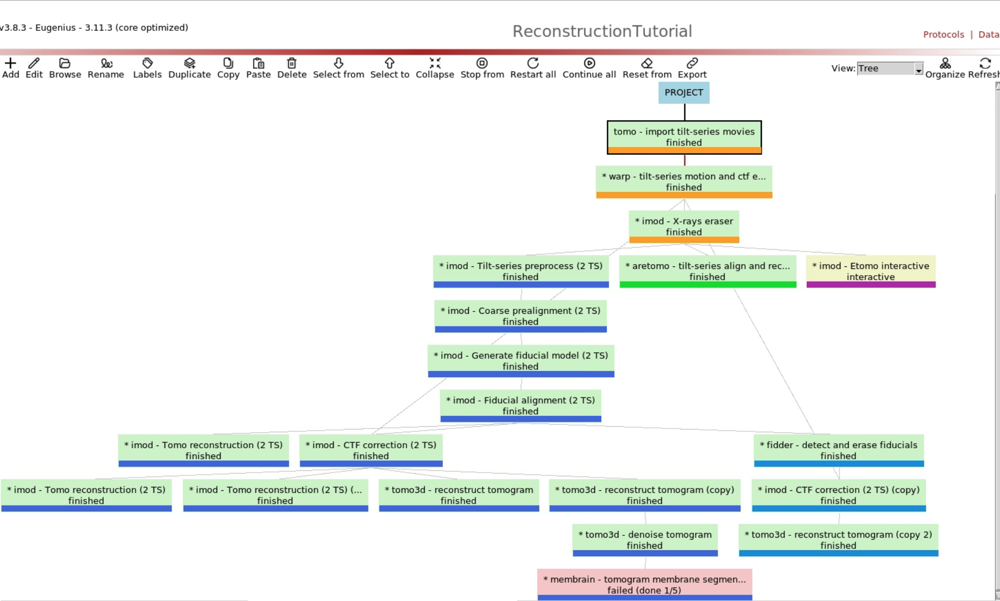
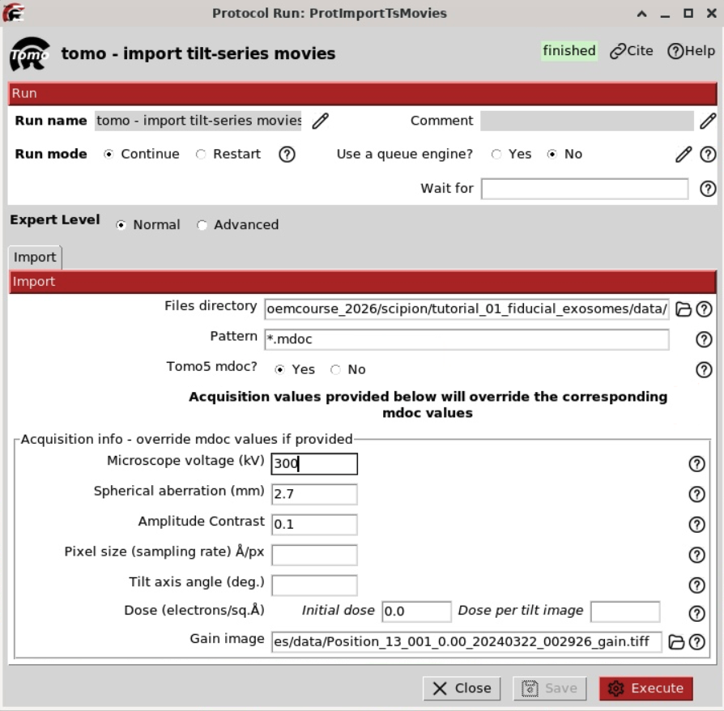
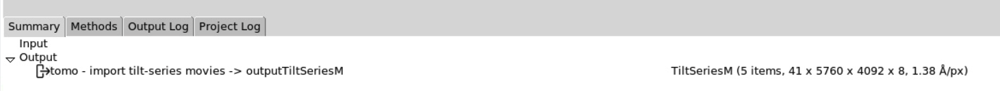
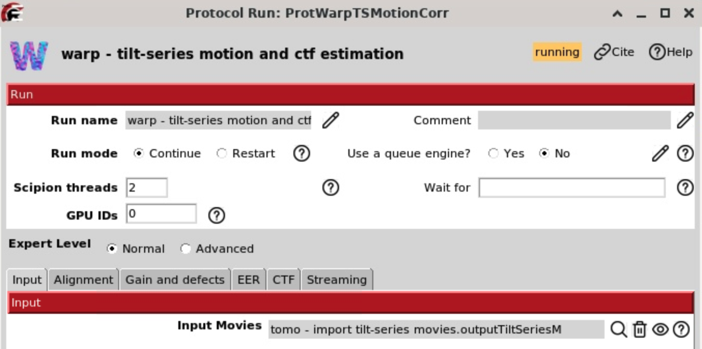
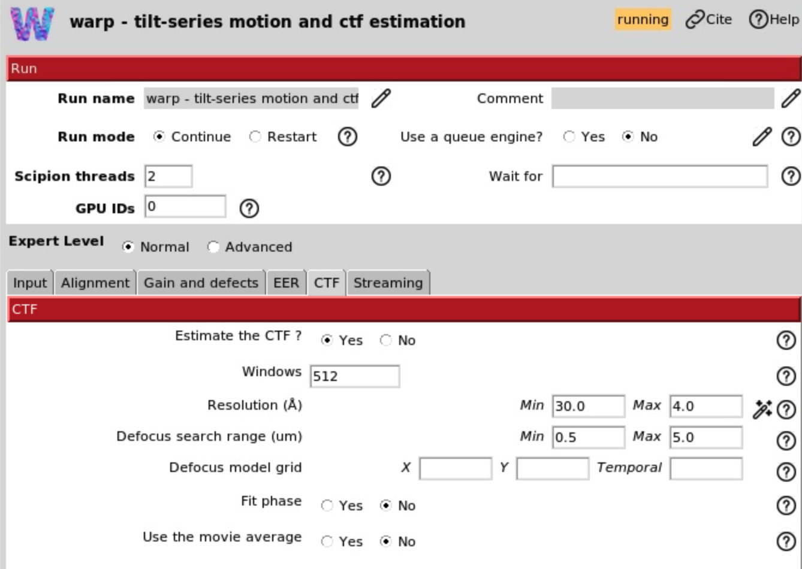
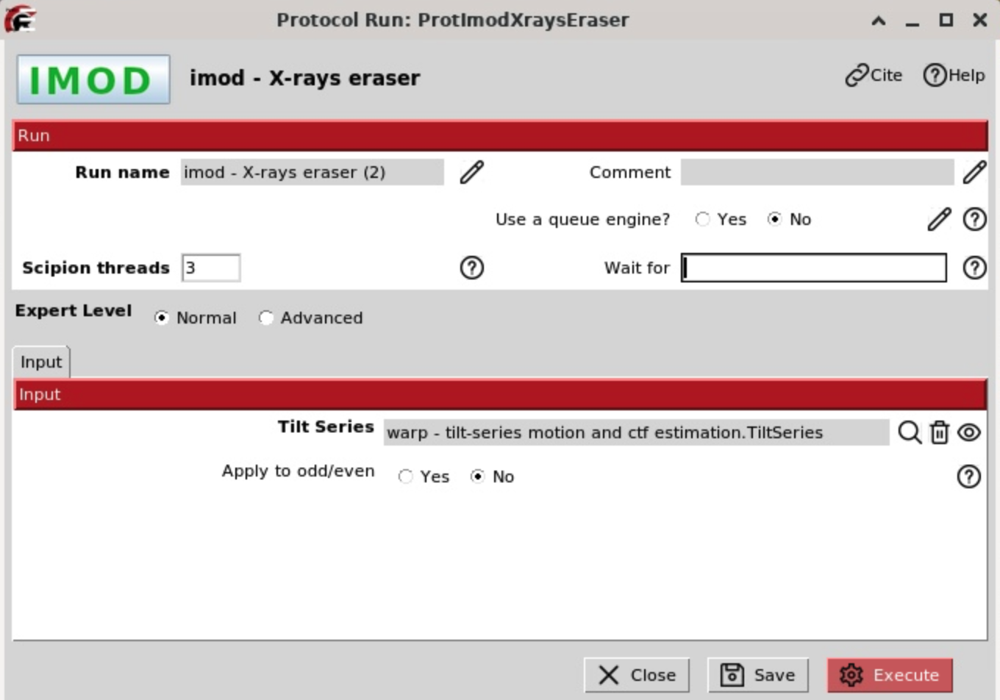
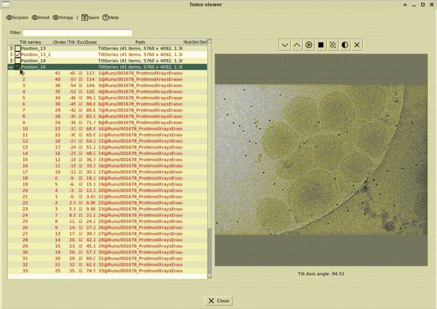
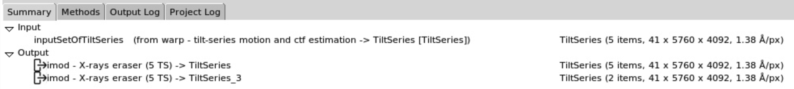

# Tutorial_01_Fiducial_Exosome Dataset
🔴 Tilt Series Inspection and Curation

## The dataset
- **Five tilt series of extracellular vesicles with fiducials**

This small dataset is intentionally designed to:
- illustrate different alignment strategies (with vs. without fiducials)
- run efficiently on a **standard laptop with GPU support** and even faster on the cluster
- allow fast iteration during the tutorial

## Set-up Scipion environment and workflow with your user account

> * Log in to: https://max-cssb-display.desy.de:3389/  
> * Open a terminal window  
> * type `module load scipion`
> * type `scipion3`
> * open scipion project `Reconstruction Workflow`
> **Note:** a default project does currently not exist for user accounts

If you do not yet have a Scipion project, create one:

> * create the project in your local directory:`/gpfs/cssb/software/tmp/cryoemcourse_2026/scipion/`  

## The workflow

> * import the workflow from: `/gpfs/cssb/software/tmp/cryoemcourse_2026/scipion/workflow/Dataset_01_Fiducials_Exosomes.json`
> * the dataset is here:`/gpfs/cssb/software/tmp/cryoemcourse_2026/scipion/tutorial_01_fiducial_exosome/data`  
> * follow the tutorial step by step

<figure>
  
  <figcaption><b>Figure 1.</b> Overview of the complete tilt-series processing workflow.</figcaption>
</figure>

## Import tilt series movies

**Reference**: [J. Jimenez de la Morena et.at. 2022](https://doi.org/10.1016/j.jsb.2022.107872)
**Plugin**: [scipion-em-tomo](https://github.com/scipion-em/scipion-em-tomo)

In this step the acquired microscope data "Tilt Series" will be imported into the Scipion framework. The protocol `tomo - import tilt series movies` allows to import different kinds of raw data. In this tutorial the raw data is a set of .tiff and .mdoc files.

> **Note**: It is mandatory that the mdoc files will be located in the same folder of the tiff files, which is usually the case.

The .tiff files are the acquired movies, while the .mdoc files store detailed acquisition information such as sampling rate, dose per frame, and tilt axis angle. The protocol will parse the .mdoc files and store this information in the Scipion database.

Protocol parameters: Microscope voltage, spherical aberration, amplitude contrast, magnification, pixel size, tilt axis angle or dose are empty. An empty entry means that the parameter will be read from the mdoc. However, if the user introduce a parameter, Scipion will take the introduced value from the user instead of the mdoc parameter. This allows to correct possible errors in the mdoc file. 

Fill in the keyparameters and execute the job.

- **Files directory:** Set the path of the movies `/gpfs/cssb/software/tmp/cryoemcourse_2026/scipion/tutorial_01_fiducial_exosome/data`
- **Pattern:** Set as `*.mdoc` to import all mdoc files.
- **Tomo5 mdoc:** Yes. 
- **Microscope Voltage:** 300kV
- **Spherical Aberration:** 2.7 mm
- **Amplitude contrast:**  0.1
- **Pixel size:** 1.38 Å/px - if you leave it empty, this value will be read from the mdoc file.
- **Tilt axis angle (deg):** We are using the value from the mdoc file. You can overwrite the mdoc by specifying the tiltaxis in e.g. -95.0
- **Dose (e/A^2):** dose per tilt - leave empty. This value will be read from the mdoc file.
- **Gain image:** Path to one gain reference image, e.g. `/gpfs/cssb/software/tmp/cryoemcourse_2026/scipion/tutorial_01_fiducial_exosome/data/filename.gain`

<figure>
  
  <figcaption><b>Figure 2.</b> Keyparameters `Import tilt series movies`.</figcaption>
</figure>

 <figure> 
  
  <figcaption> <b>Figure 3.</b> When the job has finished, open the Summary panel and verify that the import was successful in the Tomo Viewer. The Tomo Viewer displays the data and confirms the successful import of five tilt series in the correct order into the Scipion framework. </figcaption> 
</figure>

## Movie alignment and CTF estimation with Warp

**Reference**: [D. Tegunov et. al. 2021](https://doi.org/10.1038/s41592-020-01054-7)
**Plugin**: [scipion-em-warp](https://github.com/scipion-em/scipion-em-warp)

Once the tilt series movies have been imported, the next step is to convert the movies into actual micrographs, also referred to as tilts. Each movie consists of eight frames. This can be verified in the output details of the import job. To correct beam-induced motion, we use the protocol 'warp - tilt-series motion and CTF estimation'. This protocol identifies and corrects the relative movement of features between consecutive frames within each movie, producing motion-corrected tilt images. In addition, the protocol estimates the contrast transfer function for each tilt. The CTF parameters are related to the defocus of the motion-corrected images and are required for downstream alignment and reconstruction.

The most important parameters are:
- **Input movies:** The imported set of tilt series movies from the previous step.
- **Binning factor:** 1.0
- **Resolution to fit:** Min 500.0  Max 10.0 A
- **B-factor:** -500.0
- **Motion model grid:** Leave empty
- **Do even and odd:** Yes
- **Transpose gain reference:** No swap
- **Flip gain reference:** No flip
- **EER fraction:** 16 (No matter for this dataset)
- **EER group exposure:** Leave empty (No matter for this dataset)
- **Estimate CTF:** Yes. 
- **Windows:** 512
- **Resolution: (A)** Min 30, Max 8.0
- **Defocus search range (um):** Min 0.5, Max 8.0
- **Defocus model grid**: X=2, Y=2, Temporal = 8
- **Fit phase**: No
- **Use the movie average**: No

<figure> 
      
      <b>Figure 4a.</b> Motion correction parameters (input). 
       
      
      <b>Figure 4b.</b> Motion correction parameters (CTF).
<figure>

 The output of the protocol will be a set of tilt series and a set of CTFs. It is possible to visualize these set with the `TomoViewer` and `CTFtomoViewer`.

## X-ray eraser
**Reference**: [J.R. Kremer 1996](https://doi.org/10.1006/jsbi.1996.0013)
**Plugin**: [scipion-em-imod](https://github.com/scipion-em/scipion-em-imod)

During electron microscopy data acquisition, interactions of the electron beam with the sample and surrounding microscope components can generate X-rays. When these X-rays hit the detector, they produce isolated, extremely bright photons that can damage pixels or small clusters of pixels. Those defects are often referred to as hot pixels. These hot pixels are unrelated to the biological signal and can interfere with downstream processing steps, in particular alignment and reconstruction, where they may bias correlation-based methods. The IMOD protocol `imod - Xray eraser` is designed to detect and remove these hot pixels. The input to this protocol is a tilt series, typically the output of the movie alignment step. In most cases, the protocol can be executed using the default parameters. The ouput of this protocol will be a set of tilt series that looks almost identical to the input tilt series. Check the Summary → Output → TiltSeries. There are five tiltseries, image size is 5760 × 4092 pixels with a pixel size of 1.38 Å/px, the full stack contains **41 tilts**. The output shows this as `5 x 41 x 5760 x 4092, 1.38 Å/px`.

<figure> 
  
  <b>Figure 5.</b> X-ray eraser input parameters.
<figure> 

## Manual Curation and Selection of Tilt Series

At this stage of the workflow, the tilt series are inspected manually to assess data quality and to decide which tilt series or individual views should be included in further processing. 

### Excluding a full tilt series or individual views in the `TomoViewer`

In some cases, an entire tilt series should be excluded. This is necessary if there is a fundamental acquisition problem (e.g. black images, strong x/y shifts between consecutive images, or defocus issues) or if the target is not present or heavily contaminated.

Procedure
> Select the imod – X-ray eraser job and navigate to Summary → Output → TiltSeries.
> Right-Click on selected TiltSeries and open them in the `TomoViewer`.
> Investigate each TiltSeries
> Select the tilt series you want to exclude pressing the space bar or clicking the exclude checkbox. Excluded items are shown in **red**.
> Optional: select individual views you want to exclude.
> Click **Save** and when prompted, choose **Re-stack the tilt series**.

<figure> 
  
  <b>Figure 6.</b> Subset Selection in `TomoViewer`. 
   
<figure> 

This creates a new tilt-series stack containing only the selected tilt series, which will be used for the next steps of the workflow.
Close `Tomo Viewer`, select the `X-ray eraser` run in the Scipion project. The output now contains two tilt series sets: the full tilt-series set as 5 x 41 x 5760 x 4092, 1.38 Å/px, and the new created subset 2 x 41 x 5760 x 4092, 1.38 Å/px. 

<figure> 
   
  <b>Figure 7.</b> Output of X-ray eraser job after re-stack in `TomoViewer`. 
<figure> 

### Excluding CTFs in the `CTFtomoViewer`

For this dataset, there is no need to exclude CTFs. However, you may choose to do so for practice or exploration. The procedure is similar to the `TomoViewer`. Here, you exclude poor-quality CTFs, which typically appear as outliers.

 
 
 

# Next Step: Tilt-series alignment and reconstruction in IMOD, ETOMO are AreTomo

There are many methods to align tilt series. Click on the following Software Name to continue the Tutorial.

| Method  | Description |Link to Tutorial|
|--------|-------------|-------------|
| 🔵 **IMOD**    | Fiducial-based alignment, automated | [IMOD](automatic-imod.md)
| 🟢 **AreTomo** | Feature-based, automated | [AreTomo](aretomo.md)
| 🟣 **ETOMO**   | Manual, step-by-step | [ETOMO](ETOMO.md)

We will:
1. Start by looking at the full pipeline (from start to finish) to understand the overall flow.
2. Go step-by-step through what happens at each stage in **IMOD**.
3. Re-run the key steps manually in **Etomo**, so you can see how the alignment/reconstruction is done interactively.
4. Finally, run **AreTomo**, which performs alignment + reconstruction in a streamlined way (often close to “one command”).

