# Tutorial_01_Fiducial_Exosome Dataset
**Part II - Quick assessment: Automated Tilt Series Alignment and Tomogram reconstruction using IMOD**

**CryoEM Team** 🔵 **Scipion Team** 
Last update: 04 February 2026, 19:32

**keywords:** ["cryo-ET", "Scipion", "IMOD", "Etomo", "AreTomo", "reconstruction"]

**Reference**: [J.R. Kremer 1996](https://doi.org/10.1006/jsbi.1996.0013)
**Plugin**: [scipion-em-imod](https://github.com/scipion-em/scipion-em-imod)

## What you need for Part II (covered in Part I)
- **import tilt-series movies** finished
- **warp – tilt-series motion and ctf estimation** finished
- **imod – x-ray eraser** finished, hot pixels removed
- **tomoviewer – tilt series curation** finished & 2/5 tilt series selected

## 🔵 The IMOD workflow

Below are the main steps of the IMOD-based workflow as implemented in your Scipion project:
- **imod – Tilt-series preprocessing** to prepare the tilt series for alignment and reconstruction 
- **imod – Coarse prealignment**  to roughly align consecutive tilts using cross-correlation to provide a good starting point.
- **imod – Generate fiducial model**  to locate gold fiducial markers used for alignment.
- **imod – Fiducial alignment** to refine the fiducial model by minimizing residual alignment errors across all tilts.
- **imod – Tomogram reconstruction**  to reconstruct the 3D tomogram from the aligned tilt series.
- **imod – CTF correction and final reconstruction**  to apply CTF-related corrections (if used in your pipeline) and generate the final reconstruction output.

## What this tutorial will teach you
<table>
<tr>
<td align="center">
 
Motion and CTF corrected tilt series
</td>

<td align="center">
 
Aligned, interpolated tilt series
</td>

<td align="center">
 
Reconstructed tomogram (SIRT)
</td>
</tr>
</table>

## 🔵 imod – Tilt-series preprocessing

Before alignment and reconstruction, the tilt series must be prepared for IMOD-based processing.  
This step ensures **data compatibility** with IMOD workflows and prepares the stack for correlation-based alignment and fiducial tracking.
Preprocessing is a technical step: the visual appearance of the tilt series before and after preprocessing should remain **largely unchanged**.

### What happens in this step
- conversion of the tilt series into an IMOD-compatible format  
- basic cleanup and formatting (image order, metadata consistency)  
- preparation of the stack for downstream alignment and reconstruction  

The preprocessing step takes a **cleaned tilt series** (after movie alignment, CTF estimation, and X-ray eraser)  
and produces a **preprocessed tilt-series stack** ready for coarse prealignment, fiducial detection, and fiducial-based alignment.

<table>
<tr>
<td width="50%" align="center">
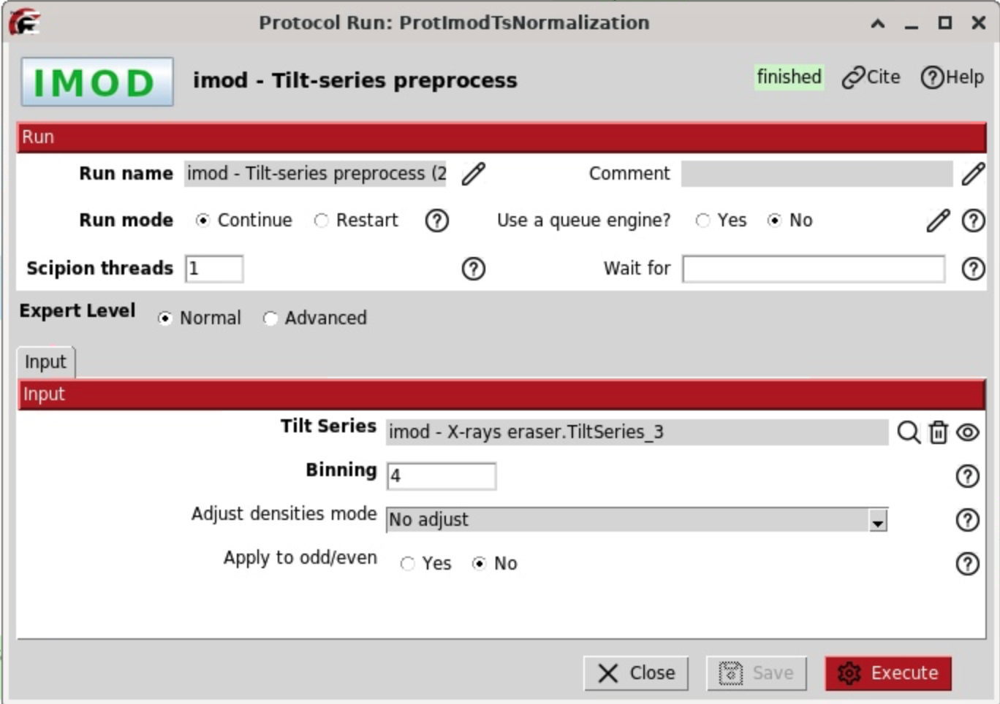 
Input cleaned tilt series
</td>
<td width="50%" align="center">
 
Output preprocessed tilt-series stack
</td>
</tr>
</table>

**Note:** Binning (important)
For fiducial tracking, the coarse-aligned stack does **not** need to be at full resolution.  
To reduce computation time and share resources efficiently, IMOD workflows typically operate on **binned data** at this stage.
In this tutorial, the prealigned stack is generated with **binning = 4**. This binned stack is used for subsequent steps.

### What to inspect after preprocessing
Open the output tilt series in **Tomo Viewer** and check the following:
- no missing or duplicated tilts
- correct tilt order (monotonic change in tilt angle)
- reasonable contrast across the tilt range
- no obvious artifacts introduced during preprocessing
- The output stack is binned with `41 x 1440 x 1024, 5.52 Å/px`

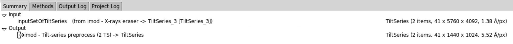

If these conditions are met, the dataset is ready for `coarse prealignment`.

## 🔵 imod – Coarse prealignment

Coarse prealignment computes an initial translational alignment between successive tilt images using cross-correlation.  This step estimates **x/y shifts only** and provides a stable starting point for fiducial tracking. Internally, IMOD runs the program `tiltxcorr`. Internally, IMOD runs the program `tiltxcorr`.

### What happens in this step
- cross-correlation between neighboring tilts  
- cosine stretching of images with higher tilt angles  
- estimation of translational shifts in x and y  
- these shifts are applied to the preprocessed tilt-series stack to generate a **coarse-aligned stack**

<table>
<tr>
<td width="55%" align="center">
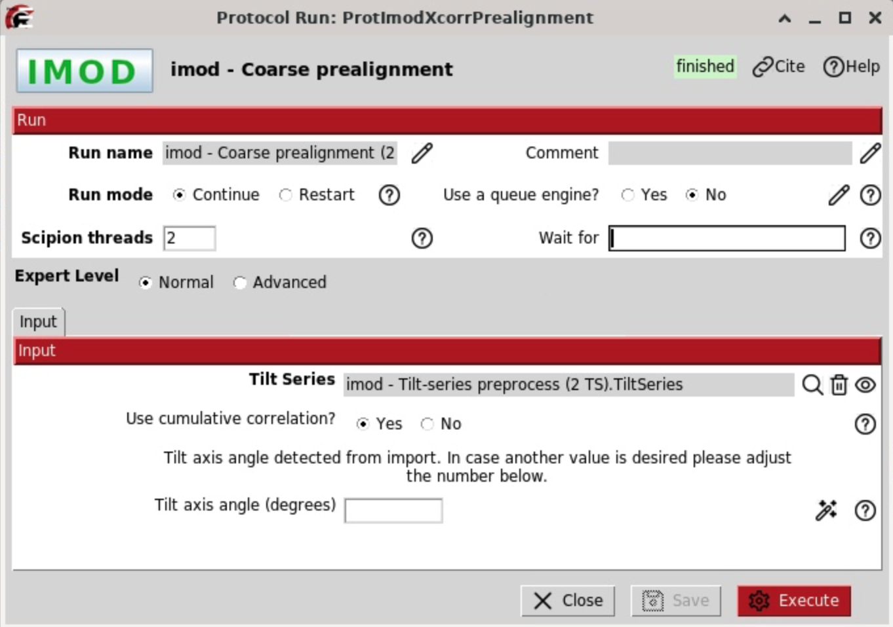 
Input: preprocessed tilt-series stack
</td>
<td width="45%" align="center">
 
Output: coarse-aligned (non-interpolated) stack.
</td>
</tr>
</table>

**Warning:** This protocol is quite sensitive to the tilt axis orientation. A wrong tilt axis orientation can be the suspicious of casting unusual results. If a wrong tilt axis orientation was imported, the tilt axis can be fixed in the tilt axis form of this protocol.

### What to inspect after coarse alignment
Open the coarse-aligned tilt series in **Tomo Viewer** and check:
- major jumps between consecutive tilts are removed
- features appear roughly aligned across the tilt range
- no obvious mis-ordering of tilts

At this stage, alignment does not need to be perfect.  
The goal is a stable starting point for fiducial model generation.

**Note:** The `+ali` flag means an alignment matrix is stored but not applied to the tilt series. To visualize the aligned series, enable "Interpolated" in the TomoViewer. This applies the transformation matrix. The `interp` flag may appear and only reflects visualization settings — it is not required for further processing.
Scipion follows the IMOD convention, where the tilt axis is aligned with the vertical Y-axis.

## 🔵 imod – Generate fiducial model

The coarse-aligned tilt-series stack is used as input and converted into a **fiducial model** containing tracked landmark positions across all tilts. 
This model defines the positions of landmarks across tilts and serves as the basis for accurate, fiducial-based alignment in the next step.

The IMOD protocol `Generate fiducial model` can be applied to both **fiducial-based** and **fiducial-less** datasets:
- in fiducial-based data, landmarks correspond to gold beads  
- in fiducial-less data, landmarks represent tracked image patches

### What happens in this step 👉 Tracking Step: Where are the fiducials in each tilt image?
- Fiducial markers are detected in the coarse-aligned tilt stack
- Fiducial positions are tracked across the entire tilt range
- A landmark model is constructed for refined alignment

<table>
<tr>
<td width="50%" align="center">
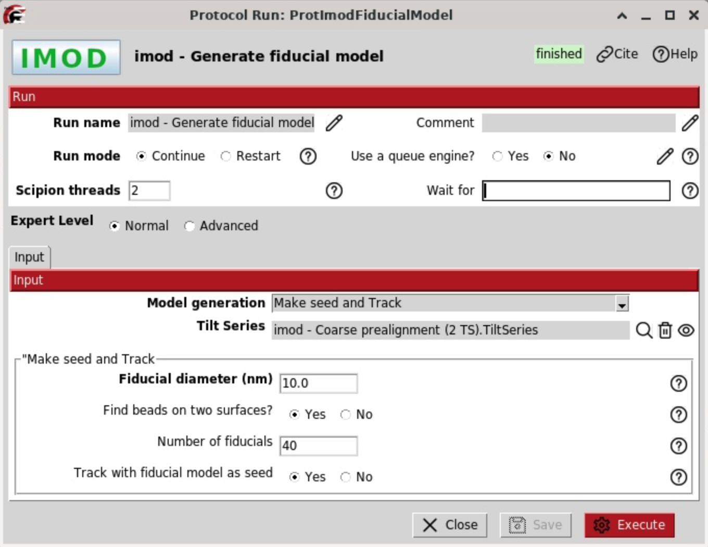 
Input: coarse-aligned tilt-series stack
</td>
<td width="50%" align="center">
 
Output: fiducial model with tracked landmark positions across the tilt range
</td>
</tr>
</table>

**Notes:** The fiducial model is stored as a `SetOfLandmarkModels` (one model per tilt series).  Typically, a small number (**10–15**) of well-spread and consistently tracked fiducials is sufficient. Poor fiducial tracking will directly reducethe quality of the final alignment. 

### Quality check: is the fiducial model complete?
Open the fiducial model in **IMOD** and check:
- Fiducials are correctly centered on gold beads
- Fiducials are tracked consistently across many tilts
- No obvious jumps or misassigned fiducials
- Use **Beadfixer** to find gaps

## 3dmod – Beadfixer (manual curation)
Opening the output `SetOfLandmarkModels` of the previous `Generate fiducial model` job in IMOD reveals a small set (~20–25) of well-distributed, pre-tracked fiducials displayed as colored contours. This procedure will display green or purple circles on all the picked gold beads throughout the tilt series. You can switch to `movie` mode and click the middle mouse button to animate through the tilt series and check that beadtrack has done its job, but you must turn 3dmod back into `model` mode before you continue.

As the `SetOfLandmarkModels` is computer-generated, further iterative refinement is required. When imod opens, it opens the tomogram and a 3dmod window, shown below. Select the ZaP Window with the tilt series and press ‘V’ to open a 3D view of the models. For this dataset they should be relatively smooth curves! Turn them by pressing the middle mouse button.

<table>
<tr>
<td width="76%" align="center">
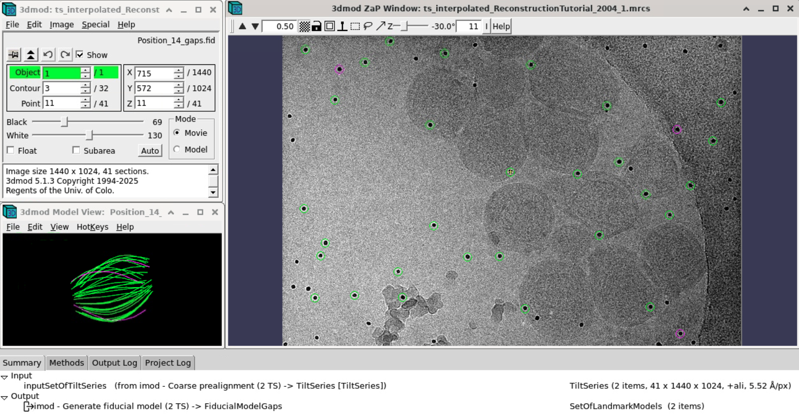 
Inspecting the fiducial model in 3dmod
</td>
<td width="24%" align="center">
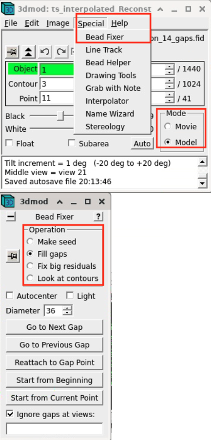 
Using the Beadfixer
</td>
</tr>
</table>

We use the Beadfixer job to check the completeness of the fiducial model. Go to Special: Beadfixer, Select Operation: Fill gaps. Hit `Go to Next Gap`. This will attach you to a point (highlighted with a yellow circle in the ZaP window) that has a missing model point on an adjacent section. Use the Page Up key or the Page Down key (or Z-slider) to go to the previous or next view, which has the missing point. Use the middle mouse button to add the point in the center of the gold particle. It is useful to increase the magnification of the image with the `+` key and adjust the contrast on the sections, especially at high tilts, in order to see the arrows. In case the missing point ends up being outside of the image, the easiest fix is to delete that contour by going back to the section where the point is selected in yellow and click `3dmod:Edit:Contour Delete` or type `Shift+d`. Repeat Go to Next Gap until the message `No more gaps are found` comes up in the main 3dmod window. Save your new model by hitting “S”. Confirm `Done saving model`is written in the 3dmod log window. Close 3dmod, press Done to complete the “Fiducial Model”. 

**Note:** The updated `SetOfLandmarkModels` replaces the previous model when saved (press **S** in 3dmod). Changes such as deleting or modifying contours are permanent and will be reflected in Scipion when the model is reopened. You can verify that your edits were saved by checking the number of contours before and after modification. This step serves as a **manual refinement** of the automatically generated fiducial model.  
The pipeline can run fully automated without user intervention, but alignment quality often improves if fiducial models are inspected and corrected manually. A common workflow is to first run the pipeline automatically, then return to this step to refine the fiducial model and rerun the downstream alignment steps.

## 🔵 imod – Fiducial alignment

Once the landmark (fiducial) models are generated and cleaned, the final alignment of the tilt series can be calculated using the `imod - fiducial alignment` protocol.
In this stage, alignment is refined by correcting:
- Translational shifts (inherited from prealignment)
- Rotational offsets
- This step aligns the tilt axis with the vertical Y-axis following the IMOD convention.

### What this step does 👉 Geometry solving step
This step uses the tracked fiducials to calculate how each tilt image must be shifted and rotated to align the tilt series. 
The protocol `imod – fiducial alignment` uses the `SetOfLandmarkModels` from the previous step to determine the transformation matrix for each tilt image, describing the sample rotation around the Y-axis.

<table>
<tr>
<td width="38%" align="center">
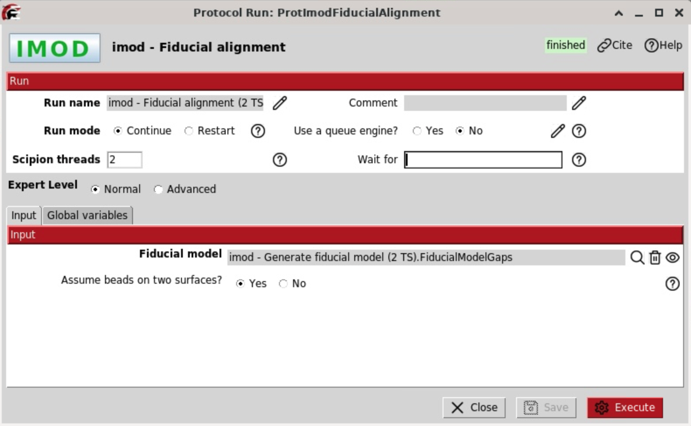 
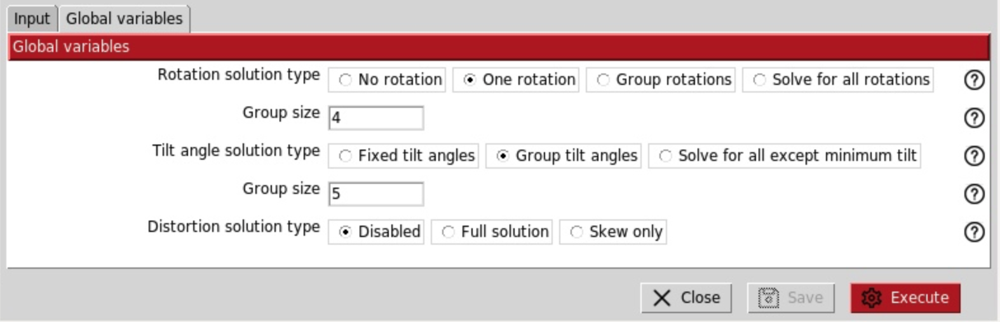 
IMOD Fiducial alignment input parameters
</td>
<td width="62%" align="center">
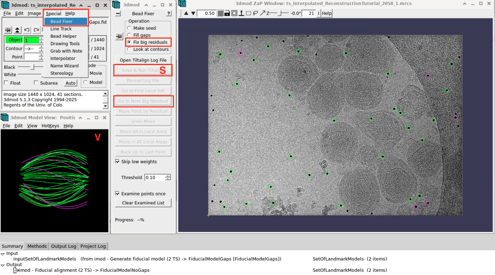 
Result: There are not big residuals to fix. Tilt-series alignment successful.
</td>
</tr>
</table>

### Output of this step
This protocol produces:
- an aligned tilt series `+ali`
- a refined `SetOfLandmarkModels` with interpolated fiducial positions
- a `SetOfCoordinates3D` describing fiducial positions in 3D space
- Use again the beadfixer to help you finding gaps.

**Tip**: The output tilt series as result of the alignment carries an (`+ali`) flag. Open it in the `TomoViewer`to see the associated transforation matrix per tilt. The shown rot, shiftX and shiftY are the rotation and shift extracted from the tilt image following the imod convention.
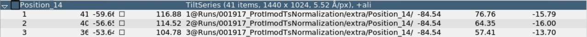 

The tilt series can be open without and without the transformation matrix applied (`interpolated`).
<table>
<tr>
<td align="center">
 
Tilt series after fine alignment
</td>

<td align="center">
 
Tilt series after fine alignment (interpolated)
</td>
</tr>
</table>

### Optional: Beadfixer to check for big residuals
Part of the process includes reducing the mean residual error to a subpixel value (<1 pixel). The following iterative steps involve fixing fiducial points with large residuals.
Technically `imod – fiducial alignment` reduces that error and interpolates the landmark gaps. Again, it is however helpful to open the Bead Helper from 3dmod main window by Clicking Special:Beadfixer. Is "Go to Next Big Residual" in the Bead Fixer dialog box active? If no, you can close 3dmod. If yes, this will select the model point that had the biggest residual and you may see that it is not centered properly on the gold bead. You can also see a red arrow pointing in the direction of the recommended move (if not, use the zoom controls in the top left corner of the ZaP window or press [+] key until it is big enough for you to see).
•	If you click Move Point by Residual in the Bead Fixer dialog box, it will move the model point by the recommended amount. This works most of the time, but if the suggested position looks wrong, you can move it by manually by centering the cursor in the center of the gold bead and then clicking the right mouse button to shift the point in the right position.
Repeat these two steps until the Go to Next Big Residual shows that no more residuals are found in the 3dmod control window. At this point you can save the model by clicking on Save or type S, and close 3dmod. 
**Note:** There are more options available in the EtomoManual [LINK], not needed in this tutorial. 

## Tomogram reconstruction

There are many methods to reconstruct tomogram in ScipionTomo framework, as they are:
 - Tomo3d
 - Imod
 - NovaCTF
 - AreTomo
 - Emantomo
 - Reliontomo

In this tutorial we will use imod and tomo3D.

## 🔵 First Tomogram reconstruction with imod

At this stage, the optimal tomogram thickness is usually unknown. Therefore, we start with a conservative first reconstruction using 300 voxels (or thicker).
Next, inspect the tomogram in Tomo Viewer or IMOD and evaluate:
- Is the tomogram centered in Z?
- How much empty volume can be cropped from the top and bottom?

For this dataset, we keep the center and crop 50 voxels from both sides, resulting in a final thickness of 200 voxels.

<table>
<tr>

<td align="center">
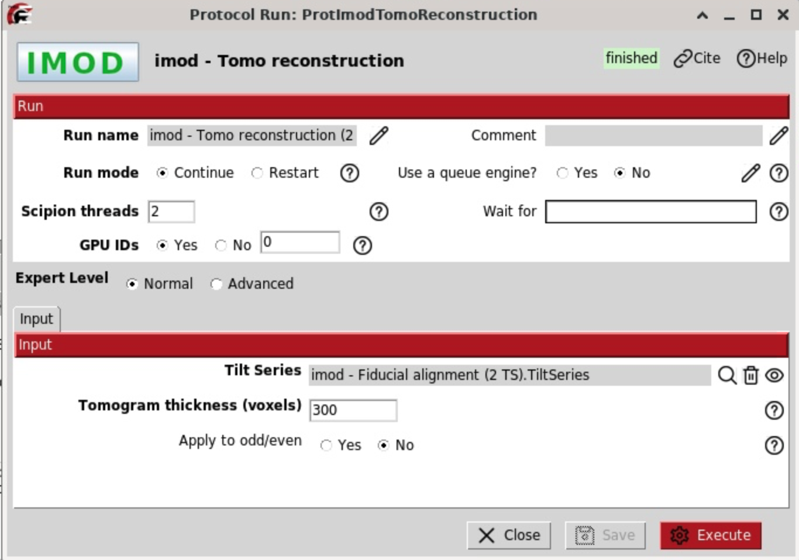 
Reconstruction parameters (300 voxels thickness)
</td>

<td align="center">
 
Initial reconstruction (300 voxels)
</td>

<td align="center">
 
Cropped reconstruction (200 voxels, centered)
</td>

</tr>
</table>

## 🔵 CTF correction

To finalize the tomogram, we apply CTF correction using the protocol `imod – correct CTF`.
This protocol takes as input:
- the **fine aligned tilt series** (with alignment metadata assigned)
- the **CTF estimates** from the WARP motion and CTF estimation step

For this tutorial, keep all parameters at their default values.

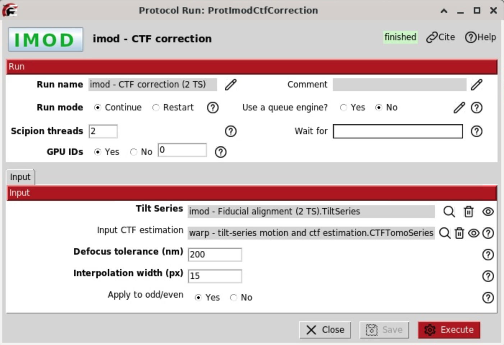
Input parameters for CTF correction

## Final tomogram reconstruction with tomo3D

**Reference**: [J.I. Agulleiro 2011](https://doi.org/10.1093/bioinformatics/btq692)[J.I. Agulleiro 2015](https://doi.org/10.1016/j.jsb.2014.11.009)
**Plugin**: [scipion-em-tomo3d](https://github.com/scipion-em/scipion-em-tomo3d)

To reconstruct the final tomogram from CTF corrected aligned tiltseries, we use `tomo3d - reconstruct tomogram`. Tomo3D provides two different reconstruction algorithm: Weighted Back Projection (WBP) and Simultaneous Iterative reconstruction technique (SIRT). Se below the visual differences. 

> **Tip**: WBP is faster than the SIRT method, but SIRT provides higher contrast. To visualize cellular enviroments SIRT is recommended, or to pick subtomogram with a template matching approach. If classical subtomogram averaging is going to be carried out, WBP is recommended.

The input of the reconstruction will be the binned CTF corrected tilt series. A SIRT recontruction is recommended in this case to produced tomograms with high contrast. The `Tomogram Thickness` was set to 300 voxels.
The output can be visualized by clicking on Analyze results or alternatively by choosing the visualization tool by right-clicking on the output in the Summary box.

<table>
  <tr>
    <th align="center">SIRT reconstruction</th>
    <th align="center">WBP reconstruction</th>
  </tr>
  <tr>
    <td align="center">
      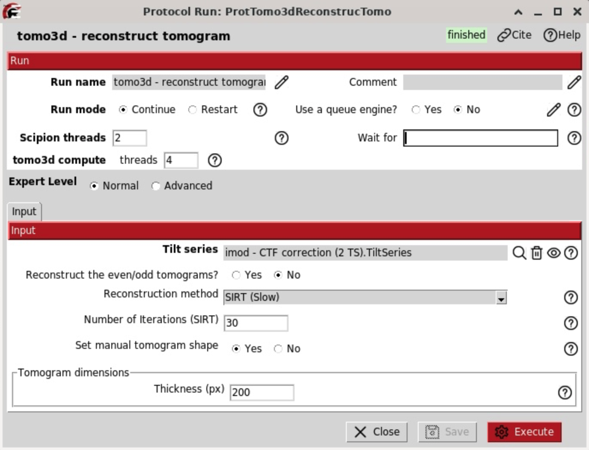
       
      <em>Input: Tomo3D reconstruction with SIRT (200 voxels)</em>
    </td>
    <td align="center">
      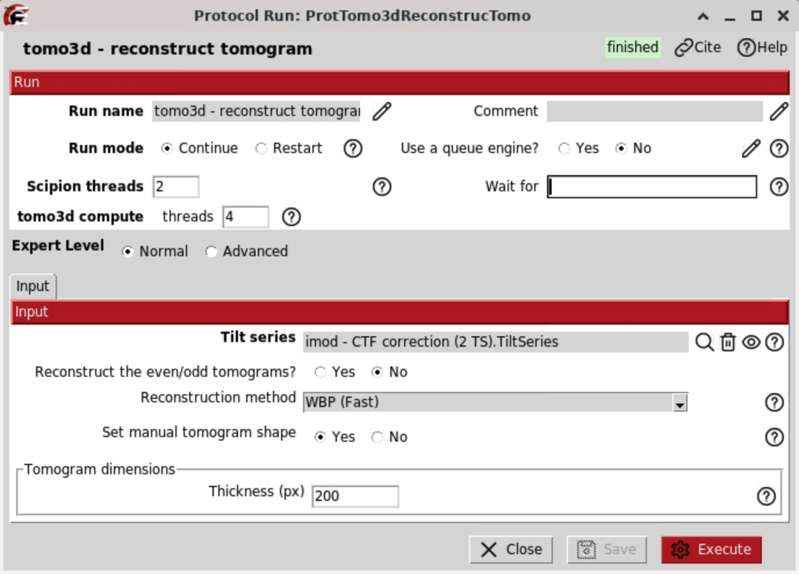
       
      <em>Input: Tomo3D reconstruction with WBP (200 voxels)</em>
    </td>
  </tr>
  <tr>
    <td align="center">
      
       
      <em>Animated Tomogram (SIRT)</em>
    </td>
    <td align="center">
      
       
      <em>Animated Tomogram (WBP)</em>
    </td>
  </tr>
</table>

# Next upcoming
## Tomogram denoise with tomo3D
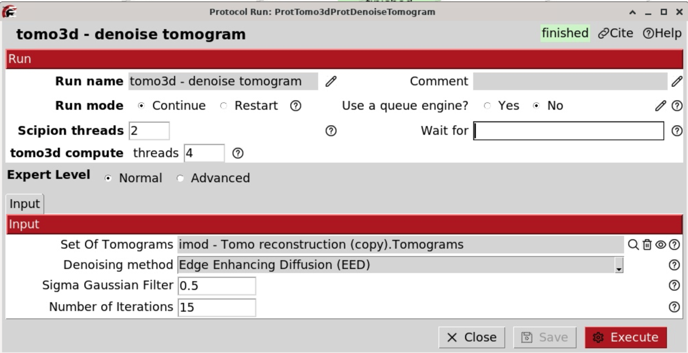

## Tomogram Segmentation

## Visualization in ChimeraX

## Fun Fact: Fidder - detects and erases fiducials

**Reference**: [TeamTomo](https://github.com/teamtomo/fidder)
**Plugin**: [scipion-em-fidder](https://github.com/scipion-em/scipion-em-fidder)

Fiducials markers were used to tilt series, due to their high contrast. However, the strong signal of the gold beads can introduce artifacts in the reconstruction. Specially, the artifacts can complicate the tomogram interpretation and introduce errors in the use of image processing algorithms as: Picking and sutomogram averaging. These effects can be avoided by erasingthe fiducial markers in the images. To do that the protocol `fidder - detect and erase fiducials` can be used. Fidder uses a U-net (deep learning) trained at 8A/px to segment the fiducials. In a second step, the segmented fiducial markers are substituted with white noise matching the local mean and global standard deviation of the image. Fidder only presents a free parameter, the threshold, which aims to determine probability threshold for deteting the gold beads. An strict value of 0.9 should work with this data set. The figures

To execute the protocol the next paramaters are used:
- *Input:*
  - **Tilt series**: `imod - Fiducial alignment`
  - **Threshold**: 0.9

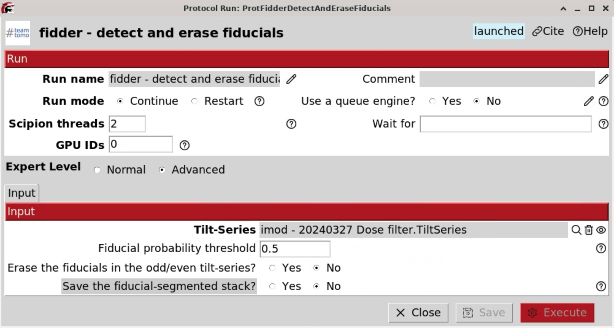
Input parameters for Fidder

Next steps include imod - CTF correction and tomo3d reconstruction.

